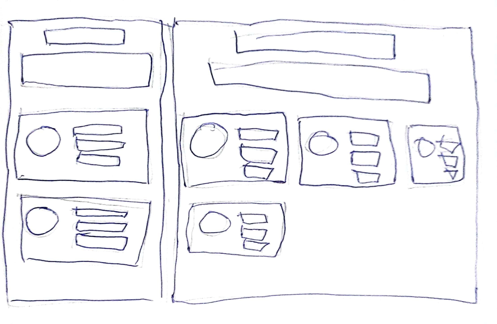
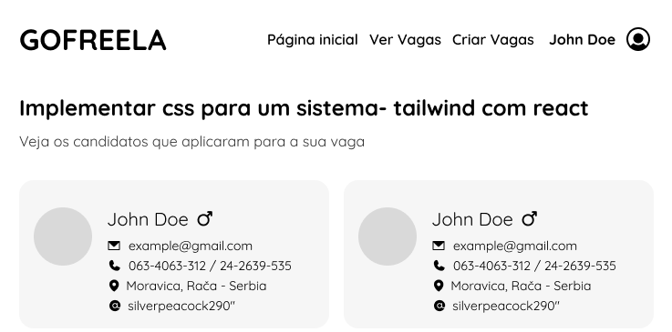
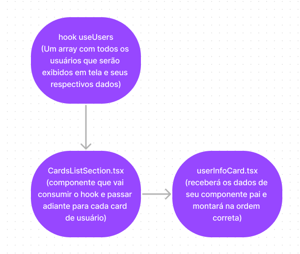
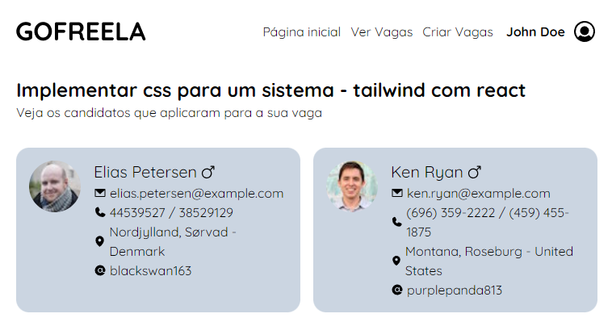

  <h1>GOFREELA</h1>

  
Esse projeto foi construido no intuito de solucionar o desafio para a 
  oportunidade  FullStack Colab

 
 

  <h2>Uma breve descrição de mim</h2>

  

  Olá! sou Thiago Fernandes, desenvolvedor web com foco no front-end e possuo habilidades em
  ferramentas como: react, next.js, styled-components, express e por aí vai... Gosto de jogos
  de pc e sou um apaixonado por desenho (mesmo não tendo muita habilidades com isso). E agora,
  apresentarei o passo a passo de como eu cheguei no resultado final dessa aplicação:
  

 
 

  <h2>Prototipação</h2>
  
  

    antes de escrever o código, decidi ter em mente qual layout eu deveria aplicar nesse projeto. Decici dar um propósito para a aplicação. Nesse cenário, estou desenvolvendo uma página onde clientes podem analisar freelancers que se inscreveram em seus serviços. A aplicação deve seguir alguns principios básicos como: ser de fácil implementação e responsivo. Para isso, decidi utilizar alguns conhecimentos de ui design e fiz um rascunho para ter uma ideia do que queria fazer.
  

  

 
 

  <h2>Wireframe</h2>

  

    Tendo a ideia em mente, agora o próximo passo é criar um wireframe no figma. Para me auxiliar nessa etapa, tirei algumas inspirações do dribbble, uma plataforma com diversos projetos de ui. <a href="https://www.figma.com/file/9G8KWn7rCGhW19BwGcfvN6/gofreela?t=wddPnRGxqcEy4ATD-6">Aqui está o link da interface no figma</a>
  

  

  

    Essa etapa do projeto também me auxiliou a escolher quais dados seriam utilizados para serem exibidos na interface e quais seriam descartados, pois há alguns dados sensiveis como senha que não cabe ser exibido devido ao contexto da aplicação.
  

 
 

  <h2>Planejamento de código</h2>

  

    Quando vou planejar um projeto, gosto de ser o mais simples possível, utilizando o mínimo de soluções merabolantes. Pois dessa forma, o projeto fica menos amarrado a bibliotecas e ferramentas e fica mais simples de ler e dar manutenção. Tendo isso em mente, optei pelas seguintes ferramentas:

    - vite → por ser um projeto menor, escolhi esse framework com menos funcionalidades embutidas
    - tailwind css → para uma estilização mais ágil e pelas opções mais fáceis de criar transições e animações
    - typescript → para garantirmos que os dados que são recebidos pela api estão de acordo com o esperado e para ganhar produtividade com o autocomplete.
    - phosphor icons → para acrescentar icones na aplicação
  

 
 

  <h2>Mão na massa</h2>

  

    Agora que todas as ferramentas estão devidamente instaladas, hora de criar os componentes para a aplicação. A principio, eu vou criar os componentes de forma estática, atentando-se primeiro para a responsividade. E então, eu criarei os hooks para capturar os dados da api e posteriormente adaptar os componentes para receberem conteúdo dinâmico.
  

 
 

  <h2>Integrando a API</h2>

  

    Feita toda a estilização e responsividade da página, agora é hora de dar vida a aplicação com dados da api. Para isso, bolei o seguinte esquema:
  

  

 
 

  <h2>Veja o resultado final</h2>

  

    acesse o resultado final com deploy <a href="https://gofreela.vercel.app/">através desse link</a>
  

  

 
 